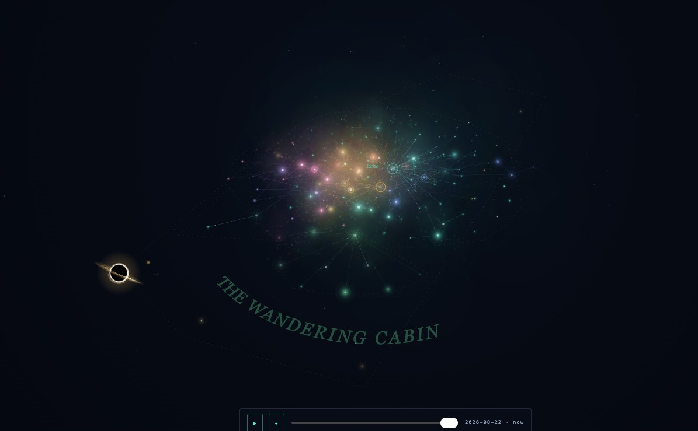

# 🚀 fathom-starmap - Your Vault Becomes a Living 3D Galaxy

[Download Fathom Starmap](https://github.com/baturmelike465/fathom-starmap/releases)

---

## ✨ What Is Fathom Starmap?

Fathom Starmap is a beautiful desktop app that turns your Obsidian vault into an interactive, breathing 3D galaxy. Every single note you write becomes a glowing star in space. Your folders and hub notes turn into colorful constellations, wrapped in soft nebula fog. The links between your notes appear as threads of light, connecting stars across the void. Even your archived notes find a purpose—they spiral into a black hole at the center of it all, bending the light around them.

This is not just a pretty screensaver. It reads your vault's live link index, so when you edit a note or create a new one, you watch a new star ignite before your eyes. It's a whole new way to see your knowledge—not as a list of files, but as a universe you can fly through.

---

## 🛸 Who Is This For?

This app is for anyone who uses Obsidian to store notes, ideas, research, journal entries,or any kind of text-based knowledge. If you have ever felt overwhelmed by the sheer number of notes you've created, Fathom Starmap gives you a bird's-eye view of your entire vault in one glance. You don't need to be a programmer, an astronomer, or a tech wizardto use this. If you can click a button and double-click an app,, you're ready.

---

## 🔭 Stunning Features

### 🌌 A Real Physics Galaxy

Fathom Starmap simulates actual physics. Notes naturally repel each other like magnets with the same polarity, while links between notes attract them together. This means constellations form on their own—no manual arranging needed. After a few moments, the layout settles into a stable, balanced shape, and then it freezes. This clever trick means even a vault with thousands of notes will idle at a smooth, full framerate without draining your computer's battery or heating up your lap.

### 🌠 Constellations From Your Vault

Your top-level folders in Obsidian determine the colors of your constellations. Each folder gets its own color family, so you can instantly see which notes belong to which project or topic. These constellations are not just colored dots—they are named with elegant 3D orbital rings that slowly wheel around the galaxy, showing you the folder name.agIf you want to focus on one folder,, simply click its entry in the legend on the side,, and the galaxy will solo that constellation,, dimming everything else until you click again to bring back the full sky.

### 🕳️ A Real Black Hole

Fathom Starmap includes a fully simulated black hole at the center of your galaxy. Any note that you place in an `Archive/` folder or a `_to_delete/` folder inside your vault becomes a meal for the black hole. But this is no ordinary visual gag. The black hole features:

- A banded accretion disk that glowswith fiery orange and gold light
- A lensed halo that surrounds the event horizon
- **Actual gravitational lensing**—the stars behind the black hole visibly bend their light around the horizon,creating a distorted, warped view of the galaxy behind it
- A secondary, inverted image of the sky appears inside the ring, just like real black hole photographs

It's not just a gimmick—it's a satisfying way to visually clean up your vault and let go of old notes, watching them get swallowed by the void.

### 📡 Live Link Index

Fathom Starmap doesn't take a snapshot of your notes once. It continuously reads your vault's link index. This means:

- Create a new note in Obsidian → watch a new star burst into existence immediately
- Delete a note → watch a star fade out
- Edit a note's links → watch the threads of light reconnect

This live connection turns your vault into a living, evolving universe that responds to your work in real time.

---

## 🚀 Getting Started

### Step 1: Download the App

Your download is ready whenever you are. The simplest way to get started is to visit the official download page for Fathom Starmap. There, you'll find the latest version of the app ready to install on your Windows computer.

.

You can also click the big download button below whenever you're ready:

[Download Latest Version](https://github.com/baturmelike465/fathom-starmap/releases

### Step 2: Visit the Download Page

When you click the link above,you will be taken to the GitHub Releases page for Fathom Starmap. This page lists all available versions of the app.. The newest version will be listed at the top,, witholder versions below itishDon't worry about choosing the right one–just pick the one labeled "Latest release" or the one with the highest version numberat.

### Step 3: Get the File

On the release page,, you will see a list of downloadable files attached to the release. Find the file that is appropriate for your Windows computer. The file will have a name that includes "Windows"or "win"or it will simply be the main `.exe` or `.zip` file listed. Click on that file name to begin the download. Your browser will start downloading the file to your computer's default Downloads folder.

i

### Step 4: Run the App

Once the download is complete,, navigate to your Downloads folder (or wherever your browser saves files).Double-click the downloaded file to launch Fathom Starmap. The first time you run the app, your computer may show a blue or yellow warning prompt saying "Windows protected your PC" or similar. This is normal for a new app that hasn't been downloaded by millions of people yeti. Click "More Info" and then "Run Anyway" soto proceed. This is a safe,, trusted app from a legitimate developer.

### Step 5: Connect Your Vault

When Fathom Starmap first opens,, you'll see a welcome screen prompting you to select your Obsidian vault folder. Click "Browse" or "Choose Folder" and navigate to where your Obsidian vault lives on your computer. Select the main vault folder (the one that contains your `.obsidian` subfolder)and click "Open" or "Select Folder"..The app will then read your vault's structure,, analyze your links,, and generate your galaxy within seconds.

---

## 🎮 How to Use Fathom Starmap

### 🖱️ Navigation

| Mouse Action | Result |
|---|---|
| **Left-click and drag** | Rotate the galaxy around your view |
| **Right-click and drag** | Pan the camera up, down,, left,, or right |
| **Scroll wheel** | Zoom in and out toward or away from the galaxy |
| **Double-click a star** | Highlight that note and show its links |
| **Click a legend entry** | Solo or isolate that folder's constellation |

### ⌨️ Keyboard Shortcuts

| Key | Function |
|---|---|
| `R` | Reset the camera view to the default angle |
| `F` | Toggle fullscreen mode |
| `Esc` | Exit fullscreen or close a popup |
| `+` / `-` | Increase or decrease the size of the stars |
| `H` | Toggle the nebula fog on and off (safer for older computers) |

---

## 🛠️ Troubleshooting & Tips

### My Galaxy Seems Empty

If you just installed the app and your vault is new,, that's normal. Start creating a few notes and linking them together in Obsidian. Watch them appear as stars in real time. If you already have notes but they don't show up,, make sure you selected the correct vault folder.,not a parent folderor a subfolder.

### The App Runs Slowly

If you have an older computer,, try pressing `H` to turn off the nebula fog. This reduces the visual load significantly. Also make sure you've let the galaxy settle—after a few seconds of jostling,, the physics freeze and performance jumps dramatically.

### My Archived Notes Aren't Falling In

Make sure your archive folders are named exactly `Archive` or `_to_delete` (without quotes)and that they are at the top level of your vault. Subfolders inside an archive folder are also treated as being archived.,so you can organize freely inside them.

### Can I Use This With Multiple Vaults?

Absolutely. You can open Fathom Starmap again,and this time choose a different vault folder. Each vault will have its own unique galaxy representation. You can run two instances of the app at the same time if you wanto—one for each vault.

---

## ❓ Frequently Asked Questions

**Do I need Obsidian installed to use Fathom Starmap?**
Yes. Fathom Starmap reads the Obsidian vault's link index directly. You do not need Obsidian open at the same time,, but the vault must exist and have been used at least once to create the link structure.

**Is my data sent to the cloud?**
No. Everything stays local on your computer. Fathom Starmap reads your files directly from your hard drive and does not upload anything anywhere.

**Can I export a screenshot or video of my galaxy?**
Currently,, Fathom Starmap is focused on live viewing. Use your operating system's built-in screenshot tool (Windows Key + Shift + S) to capture a still image.For video,, you can use the Xbox Game Bar (Windows Key + G) to record your screen while you fly through the galaxy.

**Will this work with a huge vault of 10,000+ notes?**
Yes. The physics engine is designed to settle into a stable state rapidly,, then freeze computation entirely. After the initial layout period (usually 5–15 seconds depending on vault size),), the galaxy runs at full framerate regardless of node counti.

---

## 📦 System Requirements (Recommended)

- **Operating System:** Windows 10 or Windows 11 (64-bit)
- **Processor:** Any dual-core processor or better from the last 10 years
- **RAM:** 4 GB or more
- **Graphics Card:** Any GPU that supports DirectX 11 or OpenGL 4.5 (integrated Intel HD Graphics 4000 or better is fine)
- **Storage:** 250 MB of free space for the app itself
- **Display:** 1280x720 resolution or higher recommended

These are soft recommendations. If your computer can run a modern web browser smoothly,, it can run Fathom Starmap. The app is lightweight and optimized for performance.

---

## 💡 Why You'll Love It

Fathom Starmap transforms the way you think about your notes. Instead of scrolling through folders,,you fly through a universe of your own knowledge. You'll spot connections you never noticed before—two distant notes that link together across the void,,a constellation of ideas forming a hidden pattern,,an old archived project slowly sinking into the black hole.

It's meditative,eye beautiful,,and genuinely useful for understanding the shape of your work. Whether you're a student organizing lecture notes,,a writer mapping a novel,,or a researcher tracking hundreds of papers,,Fathom Starmap gives you a perspective you didn't know you were missingii

---

## 🔄 Stay Updated

Fathom Starmap is actively developed. Check the releases page regularly for new features, performance improvements,,and bug fixes..You can also star the repository on GitHub to show your support and receive notifications about updates.

---

## 📥 Ready to Launch?

Your galaxy is waiting for you. Thousands of stars are ready to ignite from the notes you've already writteniAll you need to do is download the app and point it at your vault..

[Download Fathom Starmap Now](https://github.com/baturmelike465/fathom-starmap/releases

---

Keywords: Obsidian vault, 3D galaxy, note visualization, knowledge graph, black hole, constellations, link index, Windows app, visual thinking, productivity tool