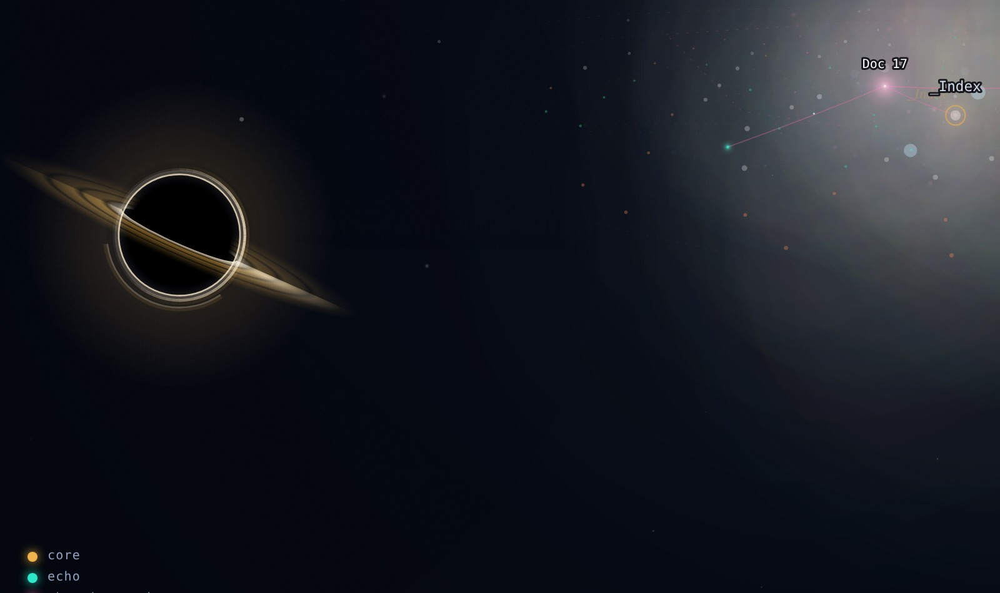
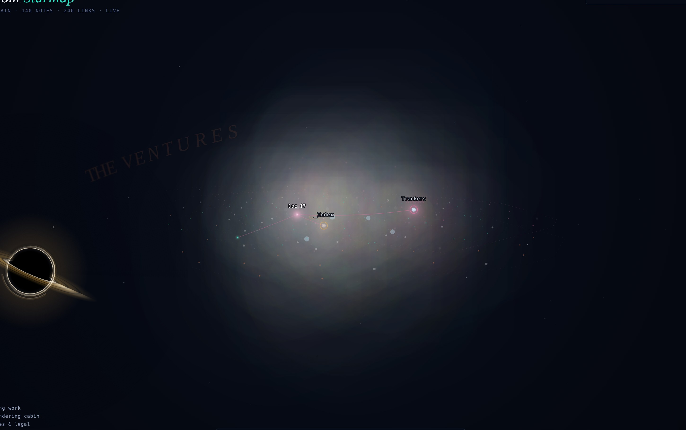

# Fathom Starmap

**Your Obsidian vault as a living 3D galaxy.** Every note is a star. Folders and hub notes become colored constellations wrapped in nebula fog, with their names wheeling on tilted orbital rings. Links are threads of light. Archived notes fall into a black hole that bends the light behind it.

It reads your vault's own link index live — edit a note, watch a star ignite.

## Features

- **A real physics galaxy** — notes repel, links attract, constellations form on their own. The layout settles, then freezes, so even huge vaults idle at full framerate.
- **Constellations from your vault** — colored by your top-level folders, named on 3D orbital rings that wheel with the galaxy. Click a legend entry to solo one.
- **A black hole** — notes in `Archive/` or `_to_delete/` are its meals. It has a banded accretion disk, a lensed halo, and *actual gravitational lensing*: the sky behind it visibly bends around the horizon, with a secondary inverted image inside the ring. Delete a note and watch it spiral in.
- **Galaxy shapes** — natural, spiral, disc, ring, shell, helix, torus, clusters (each constellation drifts to its own island), cube.
- **Spaceship flight** — press **W** to take off: mouse aims, WASD thrusts, Shift boosts, Esc lands.
- **Time replay** — scrub the timeline and watch your vault grow star by star from its first note. Press play and let it run.
- **Supernovas** — notes touched in the last few days pulse with a corona.
- **Ambient soundscape** — an optional drone that echoes when you fly, with a soft blip per constellation on hover.
- **Search** — type to find any star; the camera flies to it.
- **A full physics + display control panel** — every force and every visual is a slider. Break it, then hit "restore defaults."

## The black hole

The lensing is the point-mass lens equation from astronomy, applied twice: star positions behind the hole are deflected (a star dead behind it lands on the Einstein ring), and the painted sky around the horizon is re-rendered pulled toward it, slice by slice, so fog, glow, and text visibly smear and wrap. Hover it to see how many notes it has swallowed.

## Galaxy shapes

One click reshapes your entire vault: natural, spiral, disc, ring, shell, helix, torus, clusters (each constellation drifts to its own island), and cube.

## Install

**Manual (2 minutes):**

1. Download `main.js` and `manifest.json` from this repo (or grab the latest release).
2. In your vault, create the folder `.obsidian/plugins/fathom-starmap/` and put both files inside.
   (`.obsidian` is hidden — on macOS press `Cmd+Shift+.` in Finder to see it.)
3. In Obsidian: **Settings → Community plugins** → turn off Restricted mode if it's on → enable **Fathom Starmap**.
4. Click the star in the left ribbon.

**Via BRAT:** install the [BRAT](https://github.com/TfTHacker/obsidian42-brat) plugin, then *Add beta plugin* with this repo's URL.

## Performance, honestly

The layout physics is O(n²) — every star pushes on every other star. The plugin handles this by forming the galaxy once and then **freezing the physics** (time warp defaults to 0), so after the opening settle even a 5,000-note vault renders at full framerate. If you turn time warp up on a vault past ~1,500 notes, expect the simulation itself to get heavy. Tested on real 2,000- and 5,000-note vaults.

## Privacy

No network calls, no telemetry, nothing leaves your machine. The plugin reads Obsidian's own link index and note metadata (names, folders, sizes, dates) to draw the map — it never reads note contents.

## Credits

Designed and art-directed by **Ariel Bowyer**; built with **Fathom** (Claude). Black hole look inspired by [Matt Ebb's black hole render](https://mattebb.cargo.site/Black-Hole).

MIT licensed — do what you like, a credit is appreciated.
